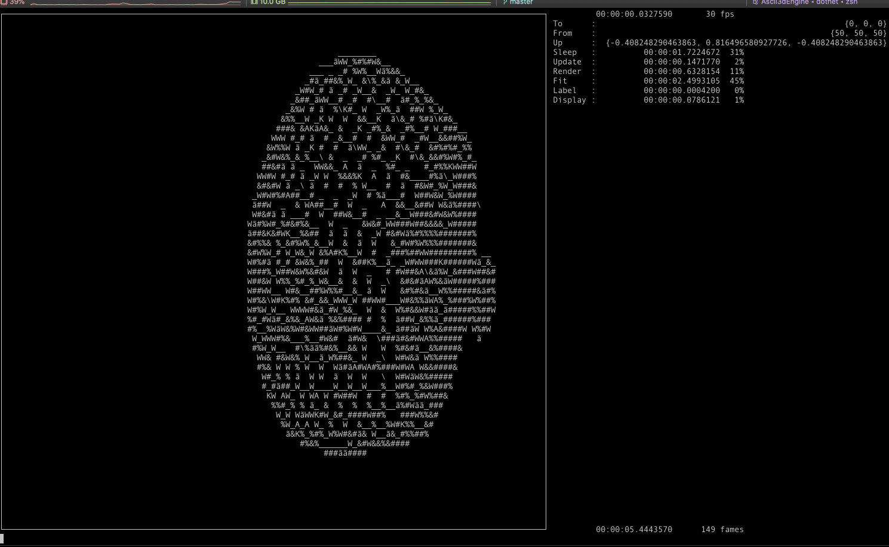

```
dotnet run -c Release --ModelFile teapot.obj --UseLineFitter --MaxFrameRate 30 --Spin --PruneMap
```



```
dotnet run -c Release --ModelFile teapot.obj --UseCharRay --MaxFrameRate 30 --Spin
```
[From](https://github.com/boxofyellow/Ascii3dEngine/commit/0ed839bb0871f6ed2ca72fc800f2c53c66349c12)


[From](https://github.com/boxofyellow/Ascii3dEngine/commit/ac1f2c13e3a026f22818d82b8ed9f36a9c91b4d6)


[From](https://github.com/boxofyellow/Ascii3dEngine/commit/ffdbd909c46ac134803e61241dffc025d1a94e75)


[From](https://github.com/boxofyellow/Ascii3dEngine/commit/ec9deff351cc36d96c192c9f21c3b7f6438b6ee4)


> **Note**: `--UseCharRay` [was removed](https://github.com/boxofyellow/Ascii3dEngine/commit/0ea672d9aaf0cc4a0bdb9b6eeb1b492359c237a4) (it is always on, --UseLineFitter was also removed at the same time)

```
dotnet run -c Release --ModelFile teapot.obj --MaxFrameRate 30 --Spin
```

[From](https://github.com/boxofyellow/Ascii3dEngine/commit/0ff303be1fa0c361558da009ea2f57b09a149b6f)


```
dotnet run -c Release --ImagePlaneFile batman.png --MaxFrameRate 30 --From "{450,450,450}" --Spin --LightSource "{0,2000,0}" --FloorHeight -250 --FloorScale 0.005 --ImageScale 0.5
```

[From](https://github.com/boxofyellow/Ascii3dEngine/commit/f52a94df1a658ed91c3876823f67e9a04e4c92d2)


```
dotnet run -c Release --ImageSphereFile earth.png --MaxFrameRate 30 --From "{2.5,2.5,2.5}" --FloorHeight 4000000 --Spin --LightSource "{5,5,10}"
```

[From](https://github.com/boxofyellow/Ascii3dEngine/commit/0a83dbe6c1f3d618998d9a686084695ebea17c45)


> **Note**: The tech demo was moved out of the "root" project and into `TechDemo` [so as of](https://github.com/boxofyellow/Ascii3dEngine/commit/0ea672d9aaf0cc4a0bdb9b6eeb1b492359c237a4) run this there.
